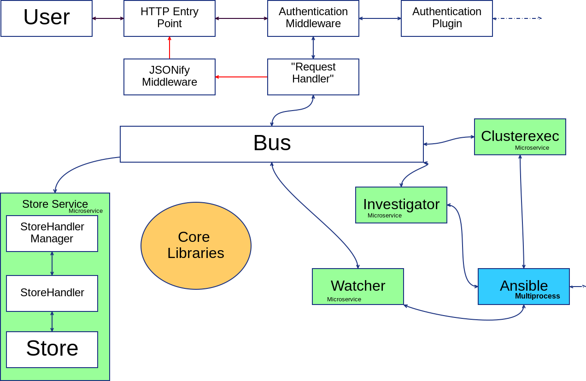

Overview
========

.. pull-quote::

   It actually configured Kubernetes when I could not remember how to.

   -- Ryan Cook

commissaire provides a lightweight, unified REST endpoint for common operational
tasks across groups of hosts. These tasks include:

- Registering new hosts in to a Container Manager
- Restarting hosts
- Upgrading hosts

In the future other operations and tighter integrations with Container Managers
will be added.

Flow
----

What commissaire Is Not
-----------------------
There are a lot of overloaded words in technology. It's important to note what 
commissaire is not as much as what it is. commissaire is not:

- A Container Manager or scheduler (such as kubernetes)
- A configuration management system (such as ansible or puppet)
- A replacement for individual host management systems

Example Uses
------------

.. note::

   This is an early list. More use cases will be added in the future.

- An administrator needs to upgrade an entire group of hosts acting as kubernetes nodes
- An administrator needs to restart an entire group of hosts acting as kubernetes nodes
- An organization would like new hosts to register themselves into a kubernetes cluster upon first boot without administrator intervention
- An organization would like to keep groups of hosts used as kubernetes nodes out of direct control of anything but kubernetes and basic operations.
